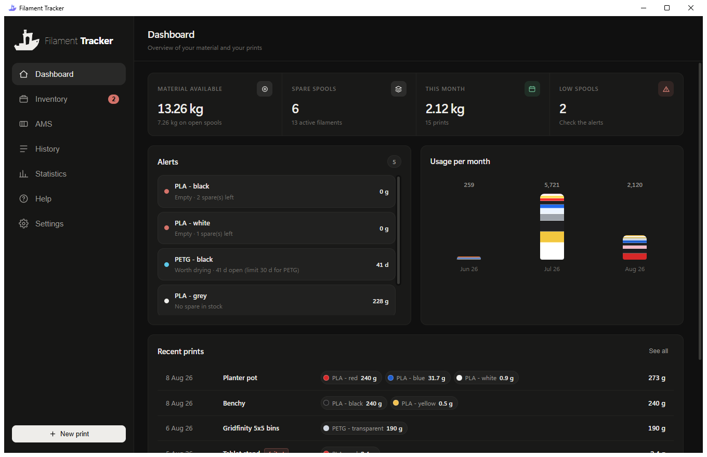
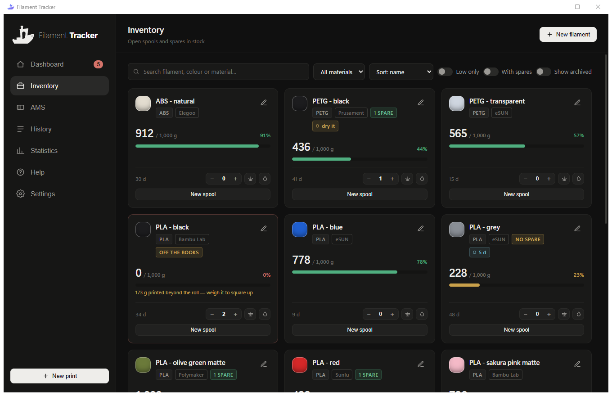
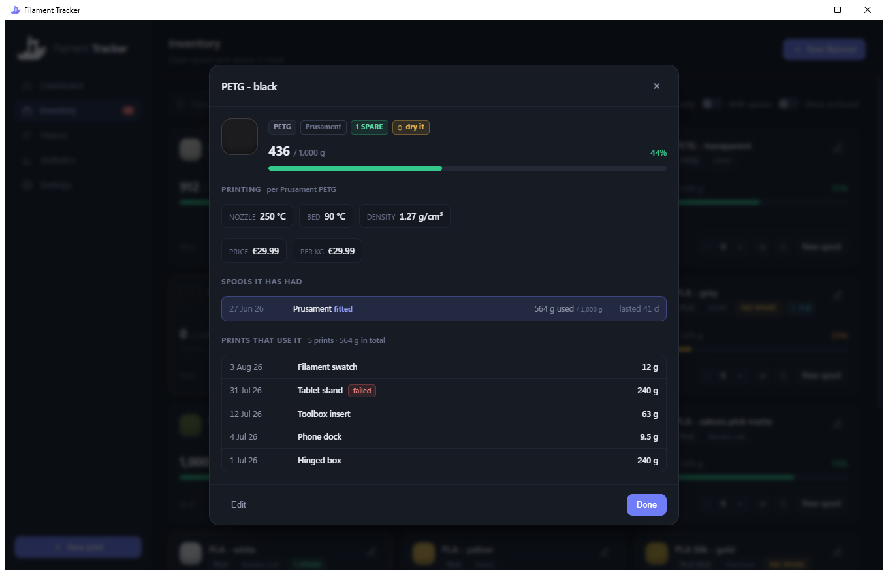
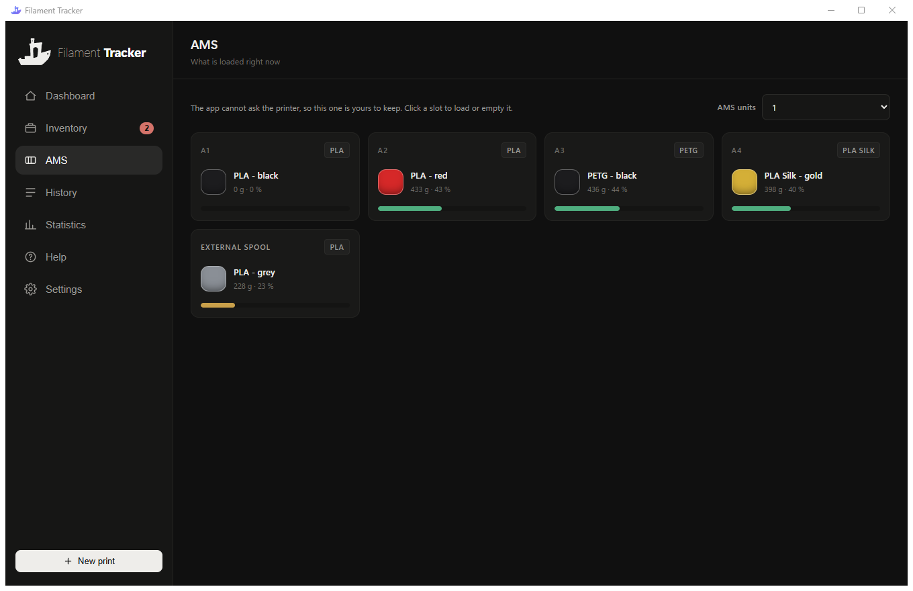
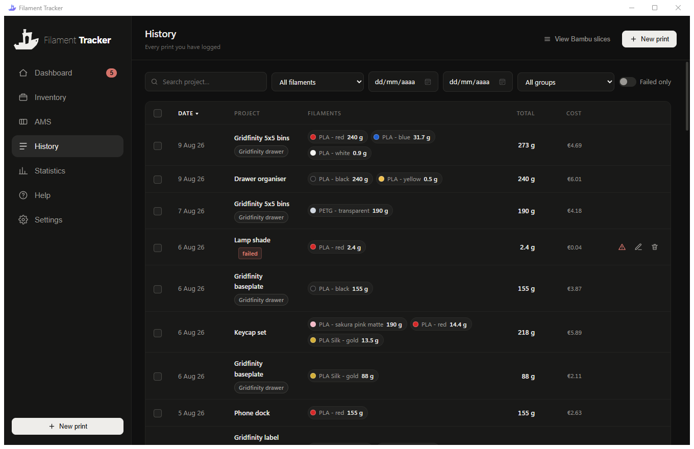
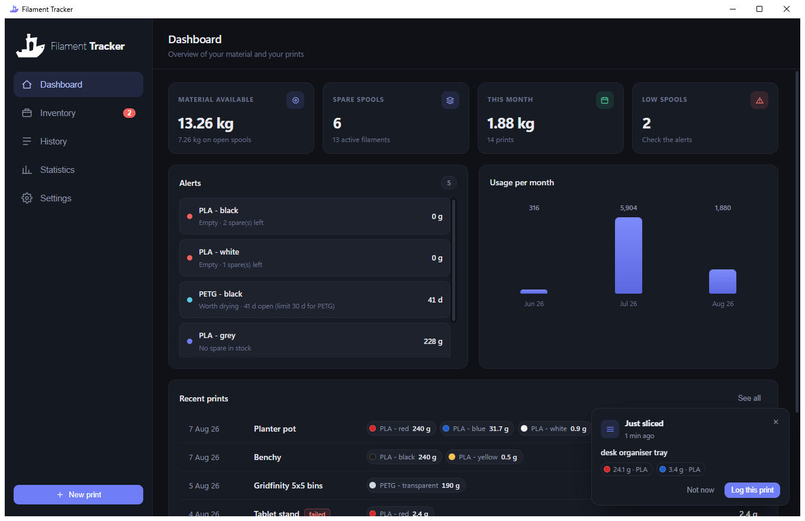
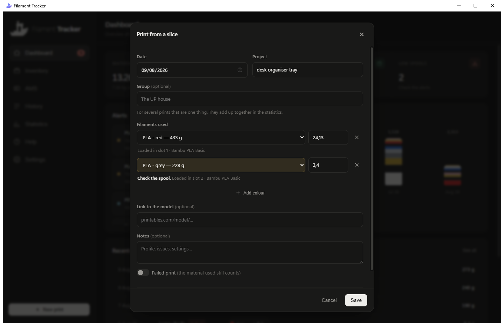
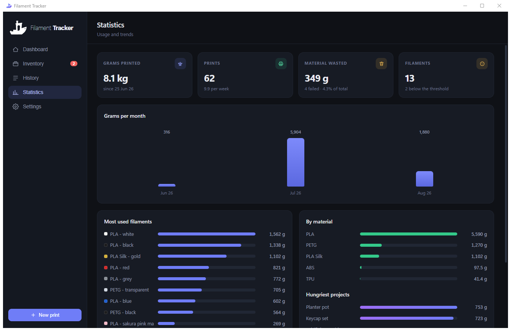
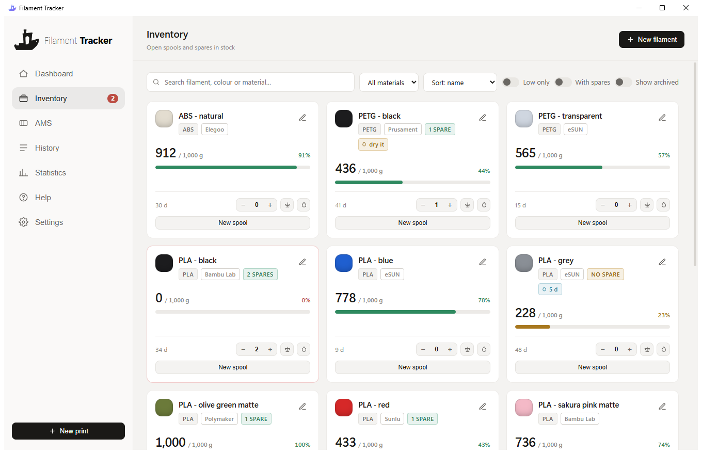

<div align="center">


# Filament Tracker

**Keep track of your 3D printing filament: how much is left on each spool, what
you have in stock, and where every gram went.**

A small desktop app for Windows. No account, no cloud, no telemetry — your data
lives in a single SQLite file next to the executable.

[Español](README.es.md) · [Download](#download) · [Manual](#manual)



</div>

---

## Why

Most of us end up with a spreadsheet: a row per print, a formula per spool, and a
sinking feeling every time we swap a roll. This app is that spreadsheet, except it
knows what a spool is — that a roll has a brand, that it runs out, that you replace
it with another one that might be from a different manufacturer, and that PETG
needs drying more often than PLA.

## Features

- **Live spool levels.** Every print you log is subtracted from the roll that is
  currently fitted. Open a new roll and the counter starts over without losing
  history.
- **Spools you have not opened.** Stock is stock: a sealed spool records no
  roll, no opening date and no drying clock until the day you open it.
- **Spares with their own identity.** Stock is not a counter: each spare spool has
  its own brand, spool type and weight, so your black can be Bambu Lab while its
  two spares are eSUN.
- **Weigh instead of guess.** Put the spool on a scale, enter the reading, and the
  app subtracts the empty-spool weight for that brand and spool type.
- **Temperatures and density.** Nozzle and bed for that exact filament, from a
  catalogue of 53 manufacturers and 415 products bundled with the app. No
  connection needed, and it says whether the figure is the product's, the
  brand's or just typical for the plastic.
- **Prices and cost per print.** Optional. Each print is costed with the roll
  that was fitted that day, in any of the 178 ISO currencies.
- **Drying reminders.** Per-material intervals, counted from opening and reset
  every time you log a drying.
- **Failed prints.** Flag a print as failed and correct the grams it actually used —
  the material that never came out goes back on the roll.
- **Reads what Bambu Studio sliced.** Slice a plate and a card offers to log
  the print with the grams already filled in and a spool suggested per colour.
  You confirm; it remembers.
- **Group prints into one project.** A house is twenty prints; group them and
  the statistics count the house, while each piece keeps its own name.
- **Statistics.** Grams per month, most used filaments, split by material, hungriest
  projects and wasted material.
- **Excel import.** Bring across an existing spreadsheet in one go.
- **AMS tab.** Which spool is in which slot right now, external holder included.
- **Light and dark.** Dark by default, and either can follow Windows.
- **Help inside the app.** The short version of this manual, a click away.
- **Six languages.** English, Spanish, French, German, Portuguese and Italian.

## Download

**1.** Download **`FilamentTracker.exe`** from the
[latest release](../../releases/latest).

**2.** Double-click it wherever you put it.

No installer, no Python, no command line. The first time you run it a `data` folder
appears next to it with your database inside.

<details>
<summary><b>Windows says "Windows protected your PC"</b></summary>

That is SmartScreen, and it says that about every program that has not paid for a
code-signing certificate. Click **More info** and then **Run anyway**.

If you would rather not take my word for it, the source is all here and you can
[build the executable yourself](#building-the-executable).
</details>

<details>
<summary><b>Nothing happens, or it mentions WebView2</b></summary>

The app draws its interface with Microsoft's WebView2 runtime. Windows 11 ships with
it; some Windows 10 installs do not. If it is missing, the app says so and offers to
open the [download page](https://developer.microsoft.com/microsoft-edge/webview2/) —
install it, then run the app again.
</details>

<details>
<summary><b>Moving the app to another folder or PC</b></summary>

Take the `data` folder with it. That folder is your database; leave it behind and
the app starts empty.
</details>

---

## Manual

### The model in one paragraph

The app holds three things: **filaments**, each with one **roll** fitted and
whatever **spares** you have in the drawer, and **prints** that spend grams of a
filament. Every roll and every spare carries its own brand, spool type, weight and
price, so one filament can move between manufacturers without changing its name.

Remaining grams on the fitted roll are:

```
remaining = roll weight − grams printed since it was opened + manual correction
```

Prints dated *before* the roll was opened count towards the filament's lifetime
total but do not touch the current roll. That is what lets you open a new spool
without wiping your history.

### Inventory



One card per filament, with the level of the fitted roll and a bar that turns amber
and then red as it empties. Click anywhere on the card to open its **detail sheet**: every roll
it has had, with brand, how much was consumed from each and how long it lasted, plus
the list of prints that used it.

The card footer has, in order: days since the roll was opened, the spare counter
(`−` / number / `+`), a **scale** button, a **droplet** button and **New spool**.

| Button | What it does |
|---|---|
| `−` / `+` | Remove or add a spare. New spares inherit the fitted roll's brand and type. |
| the number | Opens the spare list — brand, spool type and weight, editable per spare. |
| ⚖ | Correct the grams left, weighing the spool. |
| 💧 | Log a drying. |
| New spool | Fit a fresh roll, optionally consuming one of the spares. |

Filters at the top: text search, material, sort order, *low only*, *with spares* and
*show archived*.

### Temperatures and density

The detail sheet shows the nozzle and bed temperature for that filament, and its
density. They are not typed in: they come from a catalogue of **53 manufacturers,
415 products and 3531 colours** built from
[SpoolmanDB](https://github.com/Donkie/SpoolmanDB) and shipped with the app, so
none of this needs a connection.



The lookup goes from specific to general and says which it used:

| Source | Meaning |
|---|---|
| the product | the manufacturer publishes a figure for that exact filament, e.g. Bambu Lab PLA Matte |
| the brand | the brand's own range for that material |
| typical | the usual range for the plastic, whoever made it |

A spool with no brand falls back to the typical range for its plastic, and the
sheet says which of the three it is using. Settings has a **°C / °F** switch; the
data is always stored in Celsius.

The brand's real colours are offered in the colour picker too, so *Bambu Lab ·
PLA Matte* proposes the fifteen matte colours it actually sells instead of a
blank swatch.

### A spool you have not opened

A filament you own but have not started is not a roll at 100 %: it is stock. Tick
**Still sealed** when you add it and no roll is recorded at all — no opening date,
no drying clock, no gauge. The card shows what is in the drawer and its only
action is **Open a spool**.

Opening one takes it out of the stock, so two sealed spools become one fitted
roll and one spare rather than three spools. The drying clock starts that day,
which is the day it actually starts.

An unopened filament never raises an alert: it is not low and it is not empty,
there is simply nothing fitted yet.

**Correcting one you already added.** Edit the filament and the same tick is
there, as long as nothing has been printed from the fitted roll: that spool goes
back in the drawer with its brand, weight and price intact. Once you have printed
from it the tick disappears, because the roll is the window those grams are
counted in and removing it would lose them.

### AMS



Which spool is in which slot right now. The app cannot ask the printer, so this
one is kept by hand — one click on a slot to load or empty it. Every slot is
drawn whether or not it holds something, because knowing a slot is free is as
useful as knowing what is in it, and the external spool holder is always there.

Units are set from the tab itself, none to four, four slots each. A spool can
only be in one place, so loading it somewhere else takes it out of wherever it
was, and the picker tells you where each one already is.

### Logging a print

`New print` takes a date, a project name, one row per colour with its grams, an
optional link to the model page, and notes. There is no four-colour limit.



Click a row to read it. What the history shows is a summary — date, name,
colours, total — and the rest of what was recorded used to be reachable only by
opening the form, which is a strange place to be put when all you did was ask
what something was. The sheet has the group it belongs to, whether it failed,
the notes and the link, and an **Edit** button for when you did mean the form.

Each row also has, on hover, a link button (if you saved a URL), a **`!`**
button, an edit button and a delete button.

Every heading sorts: click **Total** for the heaviest prints, **Cost** for the
dearest, **Project** for A to Z, **Filaments** for the ones that took the most
colours. Clicking the same heading again turns it round, and the arrow says
which column is doing the sorting. The order survives clearing the filters and
arriving from a tile on the Dashboard, because it is not a filter.

### Grouping prints

A house is twenty prints. Each one is still its own thing in the history — a
chimney is a chimney — but you want the house to count as the house.

A **group** sits above the project name and does not replace it. There are two
ways to say which prints, because neither covers the other.

**Filter, then group.** Narrow the history until you are looking at what belongs
together and press **Group these N**, next to *Clear filters*. Searching *casa
UP* has already picked out the right rows, and the button says exactly how many
it is about to touch.

**Or tick them.** Every row has a box, the heading has one for everything on
screen, and holding **Shift** takes the whole range between two rows. Ticking
wins over the filters when there is any, which is how you say *those five* — a
thing no search can express. The selection is kept apart from the filters on
purpose: search for one thing, tick two, search for another, tick two more.


What changes once prints are in a group:

- **Statistics** counts the group instead of the individual prints, so
  *Hungriest projects* shows the house at its real weight with the colours it
  took, and clicking it filters the history to the group.
- **Searching** the group's name finds its pieces, whatever each one is called.
- The **All groups** dropdown filters the history to one group, or to what is in
  none.
- Each row shows a chip with the group's name; clicking it filters to that group.

Nothing else moves. A print that is not in a group behaves exactly as before, and
the group is only ever a name: emptying the field ungroups, and a group left with
no prints in it disappears. The same **Group** field is in the print form, so a
new print can be filed as you log it.

### After slicing in Bambu Studio

When you slice, Bambu Studio writes the plate into a folder of its own, and in
there are the grams of every filament it is about to use. Filament Tracker reads
that folder and offers the print instead of making you type it:



**Log this print** opens the normal form with the project name, the grams and a
spool already picked per colour. Nothing is recorded until you press Save, and
you can change anything first.



**The colour in a sliced file is not the spool you loaded.** Most of the time you
pick a profile because it is the only one that exists — there is no Matte under
Generic, so you select Bambu Lab's whatever spool is on the printer — or you
change the colour on the printer's screen and the slicer never hears about it.

So the strongest thing to go on is not the colour but **the slot**. A plate says
which filament slot each of its colours came from, and if the AMS tab says what
was in that slot, that is the spool the print used — whatever was picked on
screen. Failing that the suggestion goes on the material and the product line (a
*Matte* profile looks for a matte spool), with colour only breaking a tie. A row
it is not sure about is highlighted in amber with *Check the spool*, and every
row says where its suggestion came from.

The AMS tab is kept by hand, so it is never taken on trust. Two checks stand in
front of it, and an out-of-date tab cannot pass either:

- **It has to predate the plate.** Every slot records the day it was fitted, and
  a spool loaded after a plate was sliced was not in that slot when it was.
- **It has to agree with the plate.** A slot claiming PLA where the plate says
  PETG is out of date for that slot, and is ignored for it.

Past both, the slot answers — and when the colour on screen flatly disagrees with
it the row still says *Check the spool*, so you can see the two do not match and
decide.

**It learns.** The spool you confirm is remembered against that exact
material + profile + colour, so the next time the same thing is sliced there is
nothing to guess. Settings › Bambu Studio lists everything it has learned, and
anything wrong can be forgotten with one click.

The card can be switched off in Settings › Bambu Studio. *Not now* puts that
slice aside for the rest of the session and offers it again next launch; the
**×** dismisses it for good. A slice you never printed is simply never confirmed.

**View Bambu slices.** The card only offers the newest plate, and only once. In
History, next to *New print*, **View Bambu slices** lists every plate the app has
read — so one you put aside, or one sliced while the app was closed, can still be
logged. One you have already entered is marked *logged*.

The list comes from what the app kept, not from what is in the folder now, and
what it keeps is the file itself — in `data/slices`, next to the database. So a
plate read once stays readable, and a later improvement to the reading reaches
the plates already seen rather than only the ones sliced after it. Two hundred
plates are kept, about twenty megabytes.

**A plate can only be read while Bambu Studio is open.** That folder is its
scratch space, and a session deletes its own folder when it closes. On my machine
the session that ended at 04:35 took a plate sliced at 03:42 with it; it had been
readable for those fifty-three minutes and not a second longer. So the app has to
have looked before you close the slicer — open it, or leave it open, while you
are printing.

**And it only ever sees plates you sent to the printer.** Slicing alone writes
the gcode; the file the app reads appears when you send or export the plate.
Three of the nine plates in one run folder here have a gcode and nothing else —
slices that were never printed, and never offered.

**The folder.** Found on its own, and the same panel shows which one is in use
and how many sliced plates are in it — so if the card never appears you can see
whether it is reading an empty folder or the wrong one. Point it somewhere else
with **Choose…**, or put it back with **Find it for me**.

This reads Bambu Studio's own temporary folder, which is not a documented
interface. If a future version moves it, the card just stops appearing — nothing
else changes.

### Failed prints

The **`!`** button opens a short dialog that does two things: marks the print as
failed, and lets you **correct the grams actually used**. A print that stopped
halfway did not consume what you planned, so you enter what really came out and it
replaces the original figures — the unused material goes back on the roll and the
statistics recalculate. A colour set to 0 g is dropped from the print.

Failed prints still subtract material, because it was extruded all the same. They
just get tagged, can be filtered with *failed only*, and feed the **Wasted material**
figure in Statistics.

### Drying

Every roll stores the date of its last drying. The clock starts when the roll is
opened (a fresh spool comes dry) and resets each time you log one.

The card shows a droplet badge: blue with the number of days when it is fine, amber
with *dry it* once past the limit. It also appears in the dashboard alerts.

Limits depend on the plastic and live in **Settings → Drying by material**. The
defaults: PLA and its variants 60 days, PLA-CF/ABS/ASA 45, PETG 30, TPU and PC 14,
PA/Nylon/PVA 7.

About sixty materials are listed, but manufacturers name products faster than any
list can follow. Anything unrecognised falls back to **its family**, not to a flat
number: `PETG Rapid` is a PETG and gets 30 days, `TPU-95A` is a TPU and gets 14,
`PA6-CF` is a polyamide and gets 7. The material field is free text, so type
whatever is on the box — and if you disagree with the interval, it is editable.

### Weighing a spool

In the ⚖ dialog you enter what the scale reads with the whole spool on it and the
**empty spool weight**; the grams left are worked out for you.

That weight is pre-filled from the roll's **brand** and **spool type** — both are
dropdowns, and changing either updates the figure. The starting values come from
[SpoolmanDB](https://github.com/Donkie/SpoolmanDB), cross-checked against
[The Empty Spool](https://theemptyspool.cc/) and the Bambu Lab forum:

| Brand | Plastic | Cardboard |
|---|---|---|
| Bambu Lab | 250 g | 196 g |
| eSUN | 240 g | 170 g |
| Prusament | 193 g | — |
| Eryone | 187 g | — |
| Geeetech | 180 g | — |
| Overture | — | 155 g |
| Elegoo | 154 g | 154 g |
| Polymaker | — | 140 g |
| Sunlu | 130 g | — |
| Creality | 225 g | 120 g |
| Anycubic | 127 g | 125 g |
| Hatchbox | 251 g | — |
| JAYO | — | 120 g |
| Unknown brand | 220 g | 160 g |

**Treat these as a starting point.** The spread is wide even within one brand —
Bambu ranges from 196 to 253 g, eSUN from 161 to 253 — because the tooling changes
between versions. So the moment you correct the tare by weighing one of your own
spools, the app stores **your** number for that brand and type and uses it from then
on. They are also editable by hand in **Settings → Empty spool weight by brand**.

### When the books do not add up

Log 1,075 g against a 1,000 g roll and something is wrong, but not what a naive
counter would say. There is plastic on that spool, so the app does not show a
zero and call it empty — it says the books overshot, by how much, and leaves the
number alone until you decide what happened.

It asks, because **weighing corrects the number whatever the cause** and the
causes are not the same thing:

| What happened | What fixes it |
|---|---|
| The roll held more than the label said | Weigh it — a "1 kg" spool carrying 1,030 g is ordinary |
| A print went against the wrong colour | Correct that print |
| A failed print's grams were never brought down | The **`!`** button |
| **You changed the spool and never recorded it** | **Open a new roll, dated when you changed it** |

The last one is the one worth pausing for. Seventy-five grams is far more than
spool-to-spool variation, and if the cause is a silent swap then weighing makes
it worse: it welds two spools into one roll's history and leaves a permanent
correction standing on it. Opening the new roll dated to the swap moves
everything printed since onto that roll, and the mismatch usually disappears on
its own.

A correction, once made, is not silent. The roll carries it with its date on the
filament sheet — *Weighed 9 Aug 26: +175 g on the nominal, it held 1,175 g* — and
the cost per gram is worked out over what the roll really held. Ten euros over
1,175 g is not ten euros over 1,000, and every print off that roll was being
charged fifteen percent too much.

### Prices and what a print costs

Give a spool a price -- on the filament, on a new roll or on each spare -- and the
history gains a **Cost** column and Statistics a **Spent** tile. With no prices
entered, neither appears; the app does not show columns of zeroes.

Each print is costed with **the roll that was fitted that day**, not today's
price. Buying the same colour again at a different price must not rewrite what
last month cost, so replacing a 21.99 spool with one at 34.99 leaves the old
prints untouched and only charges the new rate from then on.

The currency is set in Settings and covers **all 178 active ISO 4217 codes**, not
just the majors. The name and symbol come from the system, so the list reads
"PLN - Polish zloty" in English and "PLN - esloti polaco" in Spanish, and the
same number formats as 1.234,50 EUR, US$1,234.50 or 1 235 JPY. Nothing is ever
converted and no exchange rate is fetched: prices are shown in the currency they
were entered in.

Statistics also carries the value of what is on the shelf -- what is left on the
open rolls plus the spares.

### Statistics



Grams per month, most used filaments, split by material, hungriest projects,
where the wasted material went, and by day of the week — each in its own card.
The KPI tiles on the Dashboard and here are clickable and take you to the
matching view with the filters already applied; one of them is what the drawer
is worth, which is the number nobody wants to work out by hand.

**Spend per month** is the same months in money, and it is not the same shape:
a month of cheap black and a month of silk weigh the same and do not cost the
same. The gap between the two charts is the reason to draw the second one, so
its bars are split by cost too — shading a money bar by grams would hand the
cheap filament the expensive one's share.

**How long a spool lasts** does not wait for one to run out before saying
anything. A roll half gone says as much: twenty days fitted and three hundred
grams down is already a rate, so the roll on the printer counts alongside the
ones it replaced. A material that has not used a tenth of a spool is left out —
below that the arithmetic will happily report that a colour you tried once
lasts two years.

Every bar is made of the filaments that made it, so a project, a material, a
Wednesday and a failure all draw from the same palette that is sitting in the
drawer, and none of them needs an invented colour.

*Hungriest projects* says what each one cost as well as what it weighed, once
anything has a price — the grams are what you used, and the money is usually the
part you were actually curious about.

### Importing from Excel

**Settings → Import from Excel** reads a spreadsheet exported from Google Sheets
with the sheets `Inventario`, `Historial de Impresiones` and
`Respuestas de formulario 2` (the shape a Google Form produces). Rows sharing a date
and project are grouped into one multi-colour print. Re-importing the same file does
not duplicate anything.

If your spreadsheet has a different shape, `importer.py` is about 150 readable lines.

### Backups

Every time the app starts it saves a copy of the database in `data/backups/`, one
per day, keeping the last 10. It uses SQLite's backup API rather than copying the
file, so the copy is consistent even mid-write. **Settings → Data** shows how many
there are, lets you force one and opens the folder.

### Your data

Everything lives in `data/filaments.db`, a plain SQLite file. Nothing is sent
anywhere. To back it up, copy that file. To inspect it, any SQLite browser will do.

---

### Help, and how it looks

**Help** carries the short version of this manual inside the app: the model in a
paragraph, what each control on a card does, drying, weighing, Bambu Studio, the
AMS tab and where the data lives.

**Settings → Appearance** switches between dark, light, or whatever Windows is set
to, without restarting. Dark is the default.



## For developers

### Running from source

```bash
git clone https://github.com/xserggio/FilamentTracker.git
cd FilamentTracker
py -m pip install -r requirements.txt
py app.py
```

Python 3.10+ and the two dependencies in `requirements.txt` (`pywebview` and
`openpyxl`).

### Building the executable

```bash
py -m pip install pyinstaller
powershell -ExecutionPolicy Bypass -File build.ps1
```

Leaves `dist/Filament Tracker.exe` with the icon from `brand/`.

`core.py` deliberately separates read-only resources (`web/`, which PyInstaller
extracts to a temporary folder) from data that must survive (the database, always
next to the executable). Without that split the database would end up in the temp
folder and vanish on exit.

## Project layout

```
app.py         pywebview window and the bridge to the interface
core.py        SQLite schema, paths, remaining-grams maths and statistics
catalog.py     manufacturer catalogue, temperatures and colour matching
catalog.json   53 manufacturers, 415 products, 3531 colours
importer.py    Excel reader
slicer.py      reads the plates Bambu Studio has sliced
build.ps1      PyInstaller packaging
web/           index.html · style.css · app.js · i18n.js · icon.ico
brand/         logo in navy, black and white (svg, png, ico)
tools/         catalogue builder, demo data, demo slice, demo AMS, screenshots
data/          your database (not in the repo)
```

## Credits

Empty spool weights, printing temperatures, densities and the manufacturer colour
catalogue come from [SpoolmanDB](https://github.com/Donkie/SpoolmanDB) (MIT),
cross-checked against [The Empty Spool](https://theemptyspool.cc/). Both are
community-maintained. Built on [pywebview](https://pywebview.flowrl.com/).

## License

[MIT](LICENSE).
